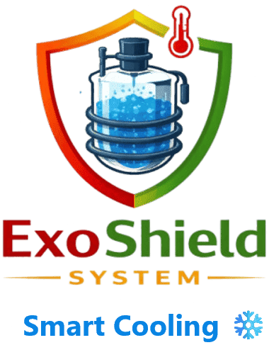

<div align="center">



# ExoShield: Smart Temperature Control System

### An IoT-Based Industrial Safety System for Preventing Runaway Exothermic Reactions

[]()
[]()
[]()
[]()
[]()

*A low-cost, intelligent and open-source reactor safety system designed for small and medium-scale chemical industries.*

</div>

---

# Table of Contents

## Table of Contents

- [Introduction](#introduction)
- [Why ExoShield?](#why-exoshield)
- [The Problem](#the-problem)
- [Project Objectives](#project-objectives)
- [Key Features](#key-features)
- [Credits](#credits)
- [Hardware Architecture](#hardware-architecture)
- [System Architecture](#system-architecture)
- [Hardware Components](#hardware-components)
- [GPIO Pin Mapping](#gpio-pin-mapping)
- [Software Architecture](#software-architecture)
- [Firmware Engineering and Technical Deep Dive](#firmware-engineering-and-technical-deep-dive)
- [Project Gallery](#project-gallery)
- [Installation](#installation)
- [Project Structure](#project-structure)
- [Contributing](#contributing)
- [Final Remarks](#final-remarks)
- [License](#license)

---

# Introduction

ExoShield is an IoT-based smart temperature monitoring and automatic cooling system developed to improve operational safety inside chemical reactors where exothermic reactions take place.

Many industrial chemical reactions naturally release heat. Under normal operating conditions this heat is removed using cooling systems to maintain a stable reaction temperature. However, if the cooling process fails or the reaction begins generating heat faster than it can be removed, the reactor temperature rises rapidly. This phenomenon is commonly known as a **runaway exothermic reaction**.

Runaway reactions are among the most dangerous events in chemical processing because they can rapidly lead to excessive pressure build-up, equipment failure, release of hazardous chemicals, fires, explosions, and severe financial losses.

Large chemical manufacturing plants often employ Distributed Control Systems (DCS), Programmable Logic Controllers (PLC), Safety Instrumented Systems (SIS), and industrial SCADA solutions to continuously monitor these processes. While these systems are extremely reliable, they are also expensive and require specialized infrastructure and maintenance.

For many small-scale and medium-scale industries, implementing such advanced safety systems is financially impractical.

ExoShield was created to bridge this gap.

Instead of relying on expensive industrial automation platforms, ExoShield combines affordable embedded hardware with modern IoT technologies to provide continuous reactor monitoring, intelligent safety decision-making, automatic cooling control, and live remote visualization through an intuitive web dashboard.

The project demonstrates that industrial safety does not always require expensive hardware—it requires intelligent engineering.

---

# Why ExoShield?

Industrial accidents caused by thermal runaway continue to be one of the leading risks in chemical manufacturing. Even a small delay in detecting abnormal temperature rise can significantly increase the probability of reactor failure.

ExoShield was designed around a simple philosophy:

> **Every chemical industry, regardless of its size, deserves access to intelligent safety systems.**

The system focuses on four major design goals:

- Continuous real-time monitoring without interrupting reactor operation.
- Automatic activation of cooling mechanisms before unsafe conditions develop.
- Immediate local notification using dynamic audible alarms.
- Remote monitoring through an integrated web interface accessible from any device connected to the local network.

Unlike traditional monitoring systems that merely display sensor values, ExoShield actively participates in protecting the reactor by making autonomous safety decisions whenever dangerous operating conditions are detected.

---

# The Problem

During an exothermic reaction, chemical energy is converted into thermal energy. If the generated heat is not removed efficiently, reactor temperature begins to rise.

As temperature increases, reaction rates also increase according to chemical kinetics. This creates a dangerous feedback loop:

```
Higher Temperature
        │
        ▼
Faster Chemical Reaction
        │
        ▼
More Heat Generated
        │
        ▼
Even Higher Temperature
```

If this cycle continues unchecked, the reactor can quickly enter an uncontrollable state known as thermal runaway.

Potential consequences include:

- Excessive reactor pressure
- Damage to reactor vessels
- Cooling system overload
- Product degradation
- Chemical leakage
- Fire hazards
- Explosions
- Production downtime
- Financial losses
- Risk to human life

The objective of ExoShield is to interrupt this cycle as early as possible by detecting abnormal temperature rise and automatically initiating corrective action.

---

# Project Objectives

ExoShield was designed with the objective of building an intelligent yet affordable industrial safety platform that can be adopted by small and medium-scale manufacturing units.

The primary objectives of the project are:

- Continuously monitor reactor temperature using a reliable digital temperature sensor.
- Provide real-time visualization through a responsive browser-based dashboard.
- Automatically activate a cooling mechanism whenever the temperature exceeds a configurable safety threshold.
- Notify nearby operators using an intelligent local alarm system.
- Allow users to configure operating limits without modifying firmware.
- Store configuration safely inside non-volatile memory.
- Maintain a responsive web server while continuously monitoring sensors.
- Demonstrate that modern embedded systems can significantly improve industrial safety at a fraction of the cost of conventional industrial automation equipment.

---

# Key Features

ExoShield integrates embedded electronics, firmware engineering, and web technologies into a single compact industrial safety solution.

Some of its major capabilities include:

- Continuous digital temperature monitoring
- Automatic cooling pump control
- Intelligent relay protection
- Dynamic audible alarm generation
- Live browser dashboard
- Real-time temperature graph using Chart.js
- OLED-based local monitoring
- EEPROM configuration storage
- LittleFS-based embedded web application
- REST API for data communication
- Fully asynchronous firmware architecture
- Responsive user interface accessible from mobile and desktop devices

Each of these features has been carefully engineered to maximize reliability while minimizing hardware cost and software complexity.

---

# Credits

ExoShield represents the collaborative effort of two engineers who contributed in different but equally important areas of the project.

## Abhijeet Vijay Bhosale

Abhijeet developed the original concept and core philosophy behind ExoShield. He identified the industrial problem, proposed the overall solution, and established the vision of creating an affordable intelligent safety system specifically for small and medium-scale chemical industries.

His contribution laid the conceptual foundation upon which the complete project was built.

---

## Rajkiran Shinde

Rajkiran transformed the concept into a fully functional engineering product.

His responsibilities included:

- Complete embedded firmware development
- Electronic hardware design and integration
- ESP8266 software architecture
- Web dashboard development
- REST API implementation
- Industrial safety logic implementation
- Commercial execution and deployment strategy

The final implementation combines embedded systems engineering, IoT technologies, and web development into a complete industrial monitoring solution.

---

> *"Engineering is not only about building technology—it is about building solutions that protect people."*

---
# Hardware Architecture

ExoShield has been designed around a modular embedded architecture where every hardware component performs a dedicated function while working together as an integrated industrial safety system.

Instead of relying on expensive industrial controllers, the system leverages affordable yet reliable embedded hardware capable of continuous monitoring, autonomous decision making, and real-time communication.

The hardware architecture follows a layered approach consisting of:

- Sensor Layer
- Processing Layer
- User Interface Layer
- Protection Layer
- Communication Layer

This modular design simplifies maintenance while allowing individual components to be upgraded without redesigning the entire system.

---

# System Architecture

```
                    Chemical Reactor
                           │
                           ▼
              DS18B20 Temperature Sensor
                           │
                     OneWire Protocol
                           │
                           ▼
                  ESP8266 NodeMCU V2
                           │
      ┌──────────────┬───────────────┬──────────────┐
      │              │               │              │
      ▼              ▼               ▼              ▼
  OLED Display    Web Server     Relay Module    Buzzer
      │                               │
      ▼                               ▼
 Local Status                  DC Water Pump
```

The ESP8266 acts as the central controller responsible for acquiring temperature data, evaluating safety conditions, controlling actuators, and serving the web dashboard over Wi-Fi.

---

## ESP8266 NodeMCU V2

The ESP8266 NodeMCU serves as the brain of the entire system. It continuously reads temperature measurements, executes the safety algorithm, hosts the embedded web server, controls the relay module, drives the OLED display, and communicates with every peripheral connected to the system.

The integrated Wi-Fi capability eliminates the need for additional communication modules, allowing operators to monitor the reactor remotely using any device connected to the local network.

The ESP8266 was selected because it provides an excellent balance between processing capability, memory, wireless connectivity, and affordability.

### Responsibilities

- Temperature acquisition
- Safety decision making
- Relay control
- Buzzer control
- OLED updates
- REST API hosting
- LittleFS web server
- EEPROM management
- Wi-Fi communication

---

## DS18B20 Waterproof Temperature Sensor

The DS18B20 is a digital temperature sensor that communicates using Maxim's OneWire protocol.

Unlike analog temperature sensors, the DS18B20 performs internal analog-to-digital conversion before transmitting temperature values digitally. This significantly reduces electrical noise and improves measurement reliability in industrial environments.

The waterproof stainless-steel probe also makes it suitable for practical deployment around industrial cooling systems and chemical reactors.

### Advantages

- Digital output
- OneWire communication
- Factory calibrated
- High measurement accuracy
- Waterproof construction
- Long cable support

---

## OLED Display

A 0.96-inch I2C OLED display provides immediate local feedback without requiring a mobile phone or computer.

Operators standing near the reactor can instantly verify system status by viewing the OLED display.

Displayed information includes:

- Current temperature
- Pump status
- Alarm state
- Wi-Fi connection
- IP address
- System messages

Using I2C communication minimizes GPIO usage, allowing additional peripherals to be connected in future versions.

---

## Relay Module

The relay module acts as the electrical isolation interface between the low-voltage ESP8266 and the higher-current DC water pump.

Whenever the measured temperature exceeds the configured threshold, the ESP8266 energizes the relay, which activates the cooling system.

Electrical isolation provided by the relay improves safety while protecting the microcontroller from high-current switching loads.

---

## DC Water Pump

The water pump represents the first active safety mechanism implemented in ExoShield.

Instead of merely notifying operators about dangerous temperatures, the system immediately begins reducing reactor temperature by circulating cooling water.

This automatic response minimizes reaction time and significantly reduces the probability of thermal runaway.

Future versions may support:

- Solenoid valves
- Industrial cooling jackets
- Variable-speed pumps
- Cooling tower interfaces

---

## Active Buzzer

The buzzer provides immediate audible notification whenever unsafe operating conditions occur.

Rather than producing a constant tone, ExoShield implements a dynamic alarm strategy where the beep frequency increases as reactor temperature rises.

This enables operators to estimate the severity of the situation without continuously observing the dashboard.

The alarm remains active until the reactor temperature returns to a safe operating range.

---

# GPIO Pin Mapping

The following table summarizes the GPIO allocation used throughout the project.

| GPIO | Peripheral | Purpose |
|------|------------|---------|
| D2 | DS18B20 | OneWire Temperature Sensor |
| D1 | OLED SDA | I2C Data |
| D5 | OLED SCL | I2C Clock |
| D6 | Relay Module | Cooling Pump Control |
| D7 | Active Buzzer | Audible Alarm |
| A0 *(Optional)* | Future Expansion | Analog Sensor Input |

The pin mapping has been intentionally kept simple to improve readability, simplify debugging, and leave additional GPIOs available for future enhancements.

---

# Design Philosophy

Unlike traditional academic embedded projects, ExoShield has been designed with practical industrial deployment in mind.

The system prioritizes:

- Reliability over unnecessary complexity.
- Fast response during abnormal conditions.
- Easy maintenance using readily available components.
- Low deployment cost.
- Modular software architecture.
- Expandability for future industrial requirements.

Every hardware decision reflects these principles.

The modular architecture also makes it straightforward to replace individual components without affecting the rest of the system, reducing maintenance costs and improving long-term serviceability.

---
# Software Architecture

ExoShield is not merely a temperature monitoring application running on an ESP8266. It is designed as a layered embedded software system where sensing, decision-making, storage, communication, and visualization operate independently while cooperating through a non-blocking firmware architecture.

Instead of placing all application logic inside the traditional `loop()` function, the firmware separates responsibilities into independent software modules. This architecture improves readability, maintainability, and responsiveness while making future expansion significantly easier.

The software stack consists of five major layers:

1. Hardware Abstraction Layer
2. Sensor Processing Layer
3. Decision & Protection Layer
4. Communication Layer
5. User Interface Layer

Each layer performs a dedicated responsibility and communicates with the others through clearly defined interfaces.

---

# Firmware Development Environment

The complete firmware has been developed in **C++** using the **PlatformIO** ecosystem running inside Visual Studio Code.

Unlike the traditional Arduino IDE, PlatformIO provides a professional embedded development workflow including dependency management, project organization, build configuration, library version control, and improved debugging support.

The project follows a modular folder structure that separates firmware, web assets, libraries, and configuration files, making the source code significantly easier to maintain as the project grows.

Major technologies used include:

| Technology | Purpose |
|------------|---------|
| C++ | Firmware Development |
| PlatformIO | Embedded Development Environment |
| ESP8266 Arduino Framework | Hardware Abstraction Layer |
| LittleFS | Embedded File System |
| EEPROM | Persistent Configuration Storage |
| ESP8266WebServer | HTTP Server |
| HTML5 | Dashboard Structure |
| CSS3 | User Interface Styling |
| Vanilla JavaScript | Client-side Logic |
| Fetch API | Asynchronous Data Requests |
| Chart.js | Real-Time Temperature Visualization |

---

# Why PlatformIO?

Although the Arduino IDE provides a beginner-friendly environment, ExoShield was intentionally developed using PlatformIO because it offers a workflow much closer to professional embedded software development.

PlatformIO provides automatic dependency management, reproducible builds, advanced project organization, and seamless integration with GitHub. These features become increasingly valuable as firmware complexity grows.

Some of the advantages include:

- Automatic library management
- Multiple build environments
- Faster compilation
- Better IntelliSense support
- Professional debugging tools
- Cleaner project structure
- Excellent Git integration

These capabilities make PlatformIO particularly well suited for medium and large embedded projects.

---

# Embedded Web Server

One of the core features of ExoShield is its integrated web dashboard.

Rather than relying on cloud services or external IoT platforms, the ESP8266 hosts its own web application directly from flash memory using the `ESP8266WebServer` library.

Whenever a client connects to the device through a browser, the server delivers the complete dashboard including HTML, CSS, JavaScript, and image assets.

The web server also exposes REST endpoints that provide live sensor data without requiring the page to reload.

This approach offers several advantages:

- No cloud dependency
- Works completely offline
- Low latency
- Simple deployment
- Better privacy
- Minimal operating cost

Because everything runs locally on the ESP8266, the dashboard remains accessible even without internet connectivity.

---

# LittleFS File System

Modern embedded web applications require multiple static resources such as HTML pages, CSS stylesheets, JavaScript files, images, and icons.

Embedding these files directly inside C++ source code quickly becomes difficult to maintain.

To solve this problem, ExoShield uses **LittleFS**, a lightweight flash file system designed specifically for embedded devices.

The complete frontend is stored inside the ESP8266 flash memory and served dynamically by the web server.

The filesystem contains:

```
data/
│
├── index.html
├── style.css
├── script.js
├── logo.png
└── other assets...
```

Separating the frontend from the firmware provides several advantages:

- Cleaner source code
- Easier web development
- Faster UI updates
- Better project organization
- Independent firmware and frontend maintenance

Whenever the user modifies the dashboard, only the filesystem image needs to be uploaded without changing the firmware itself.

---

# EEPROM Configuration Storage

Industrial safety systems must retain configuration even after power loss.

ExoShield stores all user-configurable parameters inside the ESP8266 EEPROM.

The most important value stored is the temperature safety threshold.

Whenever the operator changes the threshold from the web dashboard, the new value is immediately written to EEPROM.

During startup, the firmware automatically loads the saved configuration, ensuring that previous settings remain available after every reboot.

This eliminates the need to manually configure the system each time power is restored.

---

# REST API Design

Communication between the firmware and the web dashboard follows a lightweight REST architecture.

Instead of continuously refreshing the webpage, JavaScript periodically requests only the latest sensor information from dedicated HTTP endpoints.

Typical API endpoints include:

| Endpoint | Description |
|----------|-------------|
| `/temperature` | Returns current reactor temperature |
| `/status` | Returns pump and alarm status |
| `/threshold` | Reads configured safety threshold |
| `/setThreshold` | Updates safety threshold |

The server responds using lightweight JSON objects, minimizing bandwidth while keeping communication simple and efficient.

This architecture also allows third-party applications or future mobile apps to interact with the system without modifying the firmware.

---

# Frontend Architecture

The web dashboard has been developed using standard web technologies without relying on heavy frontend frameworks.

The interface consists of three independent layers:

- HTML defines the page structure.
- CSS provides styling and responsive layouts.
- JavaScript handles user interaction and live communication with the ESP8266.

Choosing Vanilla JavaScript instead of large frameworks such as React or Angular significantly reduces memory usage and improves loading performance on resource-constrained embedded hardware.

---

# Asynchronous Data Communication

The dashboard updates itself automatically without refreshing the webpage.

This behavior is implemented using the browser's Fetch API.

JavaScript periodically sends asynchronous HTTP requests to the ESP8266 REST server and updates only the portions of the webpage that have changed.

This provides a smooth user experience while minimizing network traffic.

Benefits include:

- No page refreshes
- Lower latency
- Better responsiveness
- Reduced bandwidth consumption
- Improved user experience

---

# Real-Time Temperature Visualization

A continuously updating temperature graph allows operators to observe reactor behavior over time.

The graph is implemented using Chart.js, which provides smooth client-side rendering directly inside the browser.

Each new sensor reading is appended to the graph without reloading the page.

The visualization allows operators to identify:

- Gradual temperature rise
- Sudden thermal events
- Cooling effectiveness
- Long-term temperature stability

This historical view provides significantly more insight than displaying only the current temperature.

---

# Memory Optimization

The ESP8266 offers limited RAM compared to desktop systems, making memory management an important design consideration.

Several techniques were employed throughout ExoShield to maximize available resources.

These include:

- Hosting static assets from LittleFS
- Avoiding dynamic memory allocation where possible
- Using asynchronous processing
- Keeping JSON responses lightweight
- Separating frontend and firmware logic
- Reusing buffers whenever possible

These optimizations improve long-term stability while reducing the probability of memory fragmentation and unexpected resets.

---
# Firmware Engineering and Technical Deep Dive

One of the primary design goals of ExoShield was to ensure that every subsystem remained responsive regardless of the current operating condition. Industrial monitoring systems cannot afford to become unresponsive while waiting for a sensor conversion or executing a lengthy delay. A delayed response could postpone cooling activation, interrupt communication with operators, or prevent timely safety decisions.

For this reason, the firmware was developed as a **non-blocking event-driven application** rather than the conventional sequential loop commonly found in beginner microcontroller projects.

Instead of executing one task at a time and waiting for it to complete, the firmware continuously cycles through multiple independent tasks, allowing sensing, communication, user interface updates, and actuator control to operate concurrently.

This architecture significantly improves responsiveness while ensuring reliable operation under continuous industrial monitoring.

---

# Firmware Execution Flow

Rather than following a simple linear execution model, the firmware continuously rotates between several independent software modules.

```
                System Boot
                     │
                     ▼
          Initialize Hardware
                     │
                     ▼
        Connect to Wi-Fi Network
                     │
                     ▼
      Load Configuration (EEPROM)
                     │
                     ▼
      Initialize LittleFS & Web Server
                     │
                     ▼
          Start Sensor Conversion
                     │
                     ▼
                Main Event Loop
                     │
      ┌──────────────┼──────────────┐
      ▼              ▼              ▼
 Read Sensor     Handle HTTP     Update Display
      │              │              │
      ├──────────────┼──────────────┤
      ▼              ▼              ▼
Evaluate Safety   Update Graph   Control Outputs
      │
      ▼
Repeat Forever
```

Unlike traditional firmware that pauses execution while waiting for individual operations to finish, ExoShield continuously cycles through all software modules, allowing every subsystem to remain active.

---

# Why Blocking Code is a Problem

Many beginner implementations of the DS18B20 temperature sensor use code similar to the following:

```cpp
sensors.requestTemperatures();
float temperature = sensors.getTempCByIndex(0);
```

Although this appears simple, it introduces an important problem.

The DS18B20 requires approximately **750 milliseconds** to complete a 12-bit temperature conversion.

By default, the DallasTemperature library waits for this conversion to finish before returning control to the firmware.

During this period the ESP8266 is effectively idle.

While waiting:

- The web server cannot respond quickly.
- OLED updates become sluggish.
- Alarm timing becomes inaccurate.
- Relay control is delayed.
- User requests experience noticeable latency.

Although a delay of 750 milliseconds may seem insignificant, it becomes unacceptable for a system expected to monitor industrial equipment continuously.

ExoShield therefore avoids blocking operations wherever possible.

---

# Asynchronous DS18B20 Temperature Acquisition

One of the most important engineering decisions in this project was implementing asynchronous temperature conversion.

Instead of waiting for the sensor to complete every measurement, the firmware disables the default blocking behavior using:

```cpp
sensors.setWaitForConversion(false);
```

Once blocking is disabled, the firmware follows a two-step process.

First, it requests a new temperature conversion.

```cpp
sensors.requestTemperatures();
```

The sensor immediately begins converting internally while the ESP8266 continues executing other tasks.

Several hundred milliseconds later, after sufficient conversion time has elapsed, the firmware retrieves the completed measurement.

```cpp
float temperature = sensors.getTempCByIndex(0);
```

Because the ESP8266 continues serving web requests during sensor conversion, the dashboard remains responsive even while new measurements are being generated.

This approach completely eliminates the typical sensor-induced lag observed in many ESP8266 projects.

---

# Task Scheduling Using millis()

Traditional Arduino programs frequently rely on the `delay()` function for timing.

For example,

```cpp
delay(1000);
```

Although simple, `delay()` stops the processor entirely.

During that one-second delay, no other software tasks can execute.

ExoShield instead uses a timer-driven scheduling mechanism based on the `millis()` system clock.

Each software module maintains its own execution interval.

For example:

```
Temperature Sampling      → Every 1000 ms
OLED Refresh              → Every 300 ms
Web Dashboard Updates     → Continuous
Alarm Timing              → Dynamic
Relay Protection          → Event Driven
```

Each task checks whether its scheduled execution time has arrived.

If not, execution immediately continues to the next subsystem.

This technique allows dozens of independent operations to run seemingly in parallel without requiring a real-time operating system.

---

# Safety Decision Engine

Every temperature measurement passes through a dedicated decision engine responsible for determining the appropriate system response.

The decision engine continuously evaluates the measured temperature against the user-configurable threshold stored inside EEPROM.

The logic follows four operating states.

```
                Safe Region
                     │
                     ▼
         Continue Monitoring
                     │
                     ▼
          Threshold Exceeded?
               Yes / No
                     │
          ┌──────────┴──────────┐
          ▼                     ▼
      Continue          Activate Cooling
      Monitoring            + Alarm
                                │
                                ▼
                   Monitor Cooling Progress
                                │
                                ▼
                     Return to Safe Region
```

Separating the decision logic from hardware control makes the firmware easier to understand, maintain, and extend.

Future versions may introduce additional operating states without affecting the existing architecture.

---

# Relay Protection Through Hysteresis

Mechanical relays are designed for a limited number of switching cycles.

If the relay switches ON and OFF repeatedly around the threshold temperature, excessive mechanical wear occurs.

This undesirable behavior is commonly known as **relay chattering**.

To prevent this, ExoShield implements temperature hysteresis.

Instead of using a single switching threshold, two independent temperatures are defined.

```
Pump ON    → 60.0°C

Pump OFF   → 59.0°C
```

Once activated, the cooling system remains operational until the temperature falls sufficiently below the activation threshold.

This simple technique dramatically increases relay life while improving overall system stability.

---

# Pump Cooldown Protection

Even with hysteresis, certain operating conditions may still generate rapid switching requests.

To further protect the cooling system, ExoShield implements a minimum activation interval.

After the relay changes state, another transition cannot occur for approximately five seconds.

This cooldown timer protects both the relay contacts and the water pump by preventing unnecessary rapid cycling.

The result is a more reliable and longer-lasting cooling system.

---

# Dynamic Audible Alarm

Unlike conventional alarms that simply remain ON continuously, ExoShield generates an adaptive warning pattern.

The alarm frequency increases proportionally with reactor temperature.

```
Normal Temperature
│
├── Alarm OFF

Warning Region
│
├── Slow Beeps

Danger Region
│
├── Medium Beeps

Critical Region
│
└── Rapid Beeps
```

This allows operators to estimate the severity of the situation without looking directly at the dashboard.

The alarm therefore communicates not only that a problem exists, but also how serious the problem has become.

---

# Fault Tolerance

Industrial monitoring systems should continue operating even when individual subsystems experience unexpected conditions.

The firmware therefore performs validation before acting upon sensor data.

Typical fault conditions include:

- Invalid sensor readings
- Sensor disconnection
- Network interruption
- EEPROM initialization failure
- Unexpected reboot

Whenever possible, the firmware enters a safe operating state while continuing to monitor remaining subsystems.

This improves robustness during long-term deployment.

---

# Engineering Considerations

Several design decisions were made specifically to improve long-term reliability rather than simply reducing development effort.

These include:

- Fully non-blocking firmware architecture.
- Independent task scheduling using `millis()`.
- Asynchronous DS18B20 conversion.
- Separation of sensing, decision making, and communication.
- Relay hysteresis for mechanical protection.
- Pump cooldown timer.
- Dynamic alarm generation.
- EEPROM-based persistent configuration.
- Lightweight REST communication.
- Local dashboard hosting through LittleFS.

Collectively, these techniques enable ExoShield to provide responsive industrial monitoring while operating within the limited computational resources of the ESP8266.

---

# Future Firmware Improvements

The modular firmware architecture has been intentionally designed to support future enhancements without major restructuring.

Potential future developments include:

- FreeRTOS-based task scheduling
- MQTT integration for industrial IoT platforms
- Over-the-Air (OTA) firmware updates
- Multi-sensor reactor monitoring
- Data logging to SD card
- Cloud synchronization
- Predictive temperature analytics
- Machine learning-based anomaly detection
- SMS and email notifications
- Industrial Modbus communication

These enhancements can be integrated with minimal changes to the existing architecture due to the modular design philosophy adopted throughout the project.

---
# Final Remarks

ExoShield represents more than an embedded systems project—it demonstrates how accessible technologies can be applied to solve real industrial safety challenges. By combining affordable hardware, robust firmware, and an intuitive web interface, the project aims to make intelligent reactor monitoring and automatic protection available to industries where conventional safety systems may be economically impractical.

The project has been developed with a strong emphasis on reliability, modularity, and maintainability. Every design decision, from the asynchronous firmware architecture to the protection algorithms implemented for the cooling system, reflects the objective of building a practical solution that can evolve into a deployable industrial product.

As an open-source initiative, ExoShield welcomes contributions from students, researchers, embedded engineers, and industry professionals. Whether your interest lies in embedded firmware, industrial automation, web technologies, or process safety, your ideas and contributions can help improve the system and expand its real-world impact.

If you find this project useful or inspiring, consider starring the repository and sharing your feedback. Every contribution, suggestion, and discussion helps move the project one step closer to making industrial safety more accessible through open engineering.

---